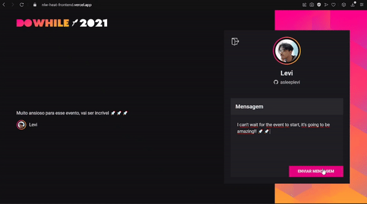

<h1 align="left">GIVE ME FEEDBACK</h1>

Give me feedback is a project developed at the NLW event by 
[@Rocketseat](http://github.com/rocketseat) to capture messages from users during the lecture doWhile.
 


## 📌 Used frameworks

&nbsp;&nbsp;&nbsp; &nbsp; 
##  📍 Published project
I have deployed the backend on [Heroku](https://www.heroku.com), and the front-end app in [Vercel](https://vercel.com/). You can see this project [here](https://nlw-heat-frontend.vercel.app). (Leave a comment) 

## 🚀 To the next level
I made some new features to challenge myself, and improve the initial purpose:
- Micro-interactions implemented when the message is sent and appears on the main screen ✅
- Added a timeout when the message is sent, to prevent messages from flooding ✅ 
- Add support for English

## 🧑‍💻 How install

1 - Clone this repository:
```bash 
git clone https://github.com/asleeplevi/give-me-feedback.git
```
2 - Install de dependencies:
```bash
#npm
npm install 
# or yarn
yarn install
```
3 - Run `dev` script
```bash
#npm
npm run dev
#or using yarn
yarn dev
```
Developed with :heart: by levi
